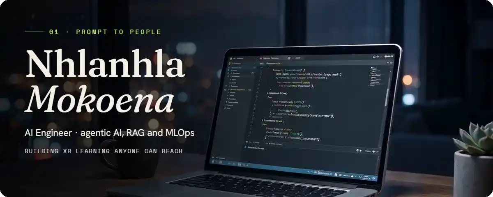
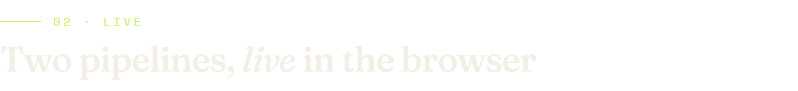
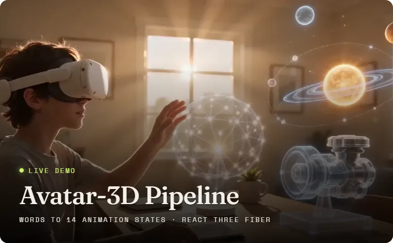
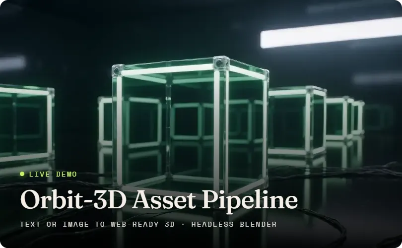
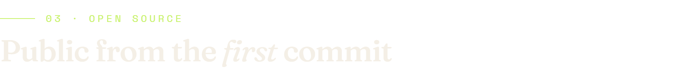
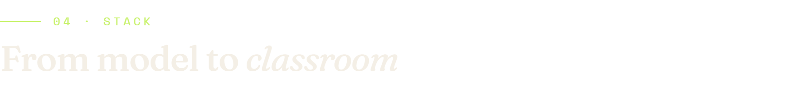
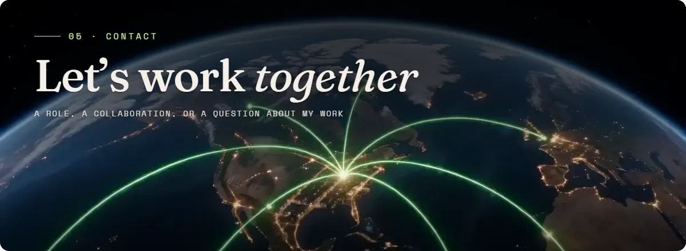

  <picture>
    <source media="(prefers-reduced-motion: reduce)" srcset="assets/banner-still.webp">
    
  </picture>

 

**AI Engineer at Nudle**, XR simulations. I engineer the generative pipelines behind XR simulation
learning: a headless Blender agent framework that builds 3D lesson environments, multimodal text-
and image-to-3D generation, text-to-video lesson animation, and the containerised GPU serving
underneath.

Traditional education gates real skills behind resources and rigid methods. I'm building toward
learning where anyone, anywhere, can practise real skills interactively.

<h3>
  <picture>
    <source media="(prefers-color-scheme: dark)" srcset="assets/ch-live-dark.webp">
    <source media="(prefers-color-scheme: light)" srcset="assets/ch-live-light.webp">
    
  </picture>
</h3>

   

**[Avatar-3D Pipeline](https://avatar-pipeline.vercel.app)**: natural language to 14 validated 3D
animation states. An LLM router under strict Pydantic validation, rendered in Next.js and React
Three Fiber. [Code](https://github.com/Murci20965/avatar-pipeline)

**[Orbit-3D Asset Pipeline](https://orbit-3d-pipeline.vercel.app)**: text or image to web-ready 3D.
Tripo3D generation, a vision model for context, and a Dockerised headless Blender engine that
Draco-compresses each mesh. [Code](https://github.com/Murci20965/orbit-3d-pipeline)

<h3>
  <picture>
    <source media="(prefers-color-scheme: dark)" srcset="assets/ch-open-dark.webp">
    <source media="(prefers-color-scheme: light)" srcset="assets/ch-open-light.webp">
    
  </picture>
</h3>

- **[Real Estate Price Predictor](https://github.com/Murci20965/real_estate_price_predictor)**: XGBoost, R² 0.9037 and RMSE 0.1341 (log scale), served by FastAPI, shipped to AWS by GitHub Actions.
- **[Medical Image Classifier](https://github.com/Murci20965/medical_image_classifier)**: ResNet50 transfer learning for pneumonia detection, 82.85% accuracy and 0.96 recall.
- **[Cat vs Dog Classifier](https://github.com/Murci20965/cat-dog-classifier)**: a FastAI CNN taken end to end, served by FastAPI with a Gradio UI.
- **[Resume-Match AI](https://github.com/Murci20965/resume-match-ai)**: LLM fit scoring between a resume and a job posting.
- **[Smart-Spend](https://github.com/Murci20965/smart-spend)**: a personal-finance API on FastAPI, PostgreSQL, Redis and Hugging Face models.

<h3>
  <picture>
    <source media="(prefers-color-scheme: dark)" srcset="assets/ch-stack-dark.webp">
    <source media="(prefers-color-scheme: light)" srcset="assets/ch-stack-light.webp">
    
  </picture>
</h3>

<picture>
  <source media="(prefers-color-scheme: dark)" srcset="assets/stack-dark.webp">
  <source media="(prefers-color-scheme: light)" srcset="assets/stack-light.webp">
  
</picture>

The stack as text

| | Layer | Tools |
|---|---|---|
| 08 | XR & 3D | WebXR · React Three Fiber · headless Blender · TRELLIS |
| 07 | Architecture & Systems | System design · scalable architecture · microservices |
| 06 | Cloud & Tools | AWS · Microsoft Azure · Hugging Face Spaces · Render · Vercel |
| 05 | MLOps & Delivery | Docker · Git · GitHub Actions CI/CD · end-to-end MLOps pipelines · serverless |
| 04 | Frameworks & Languages | Python · FastAPI · Next.js · React · Node.js |
| 03 | Agentic AI & GenAI | LangChain · LangGraph · n8n · RAG pipelines · vector databases · multi-agent workflows · Claude & OpenAI APIs |
| 02 | ML & Deep Learning | PyTorch · Scikit-Learn · Weights & Biases · fine-tuning · inference & evaluation |
| 01 | Data & Libraries | Pandas · NumPy · Matplotlib · SQL · ETL pipelines |

 

  <a href="https://my-site-six-rose.vercel.app"><b>Portfolio</b></a> ·
  <a href="https://www.linkedin.com/in/nhlanhla-mokoena-32b22b174/"><b>LinkedIn</b></a> ·
  <a href="mailto:nhlanhla18mokoena@gmail.com"><b>Email</b></a>

Set in Fraunces, Hanken Grotesk and Space Mono. The frames are from the film on my portfolio.

