  <picture>
    <source media="(prefers-color-scheme: dark)" srcset="assets/header-dark.svg">
    
  </picture>

### Now

**AI Engineer at Nudle**, XR simulations. I engineer the generative
pipelines behind XR simulation learning: a headless Blender agent framework that builds 3D lesson
environments, multimodal text- and image-to-3D generation, text-to-video lesson animation, and
the containerised GPU serving underneath.

### Why

Traditional education gates real skills behind resources and rigid methods. I'm building toward
learning where anyone, anywhere, can practise real skills interactively.

### Live

| Project | What it does | |
|---|---|---|
| **Avatar-3D Pipeline** | Natural language to 14 validated 3D animation states: an LLM router under strict Pydantic validation, rendered in Next.js and React Three Fiber | [Live demo](https://avatar-pipeline.vercel.app) · [Code](https://github.com/Murci20965/avatar-pipeline) |
| **Orbit-3D Asset Pipeline** | Text or image to web-ready 3D: Tripo3D generation, a vision model for context, and a Dockerised headless Blender engine that Draco-compresses each mesh | [Live demo](https://orbit-3d-pipeline.vercel.app) · [Code](https://github.com/Murci20965/orbit-3d-pipeline) |

### Open source

- **[Real Estate Price Predictor](https://github.com/Murci20965/real_estate_price_predictor)**: XGBoost, R² 0.9037 and RMSE 0.1341 (log scale), served by FastAPI, shipped to AWS by GitHub Actions.
- **[Medical Image Classifier](https://github.com/Murci20965/medical_image_classifier)**: ResNet50 transfer learning for pneumonia detection, 82.85% accuracy and 0.96 recall.
- **[Cat vs Dog Classifier](https://github.com/Murci20965/cat-dog-classifier)**: a FastAI CNN taken end to end, served by FastAPI with a Gradio UI.
- **[Resume-Match AI](https://github.com/Murci20965/resume-match-ai)**: LLM fit scoring between a resume and a job posting.
- **[Smart-Spend](https://github.com/Murci20965/smart-spend)**: a personal-finance API on FastAPI, PostgreSQL, Redis and Hugging Face models.

### Stack

  &nbsp;
  &nbsp;
  &nbsp;
  &nbsp;
  &nbsp;
  &nbsp;
  &nbsp;
  &nbsp;
  &nbsp;
  &nbsp;
  &nbsp;
  

**Agentic AI and RAG:** LangChain · LangGraph · n8n · vector databases · multi-agent workflows ·
Claude and OpenAI APIs. **MLOps:** Docker · CI/CD · Hugging Face Spaces · Render · Vercel.

### Activity

<picture>
  <source media="(prefers-color-scheme: dark)" srcset="https://raw.githubusercontent.com/Murci20965/Murci20965/output/snake-dark.svg">
  
</picture>

### Find me

[Portfolio](https://my-site-six-rose.vercel.app) · [LinkedIn](https://www.linkedin.com/in/nhlanhla-mokoena-32b22b174/) · [Email](mailto:nhlanhla18mokoena@gmail.com)
